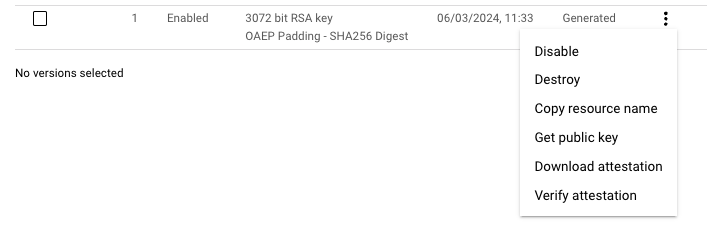
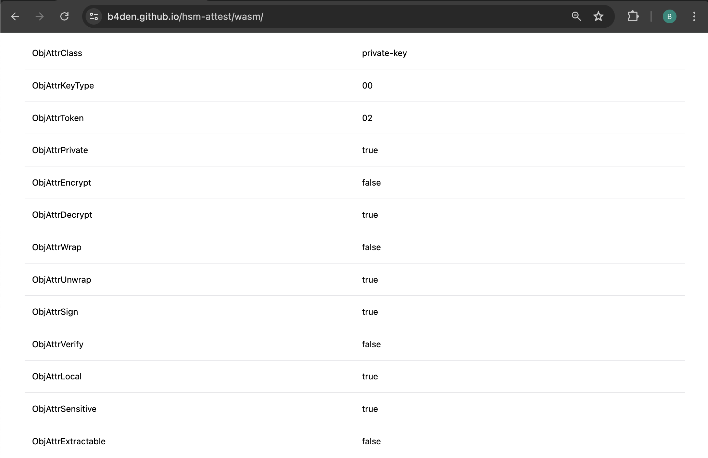
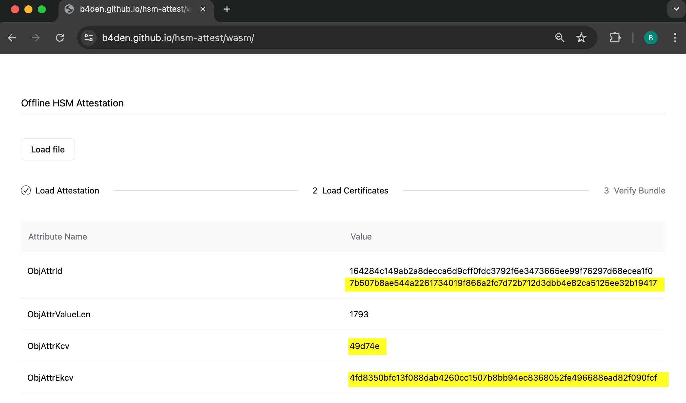

## Introduction
The security and integrity of `keys` in the cloud ecosystem are an important property of any distributed system and information
exchange scheme. To that end this document serves as a guideline for verifying the integrity of CloudHSM (Hardware Security
Module) backed keys that aim to answer three specific questions:

1. Are private keys stored in a FIPS 140-2 Level 3 compliant manner?
2. How can you ensure that corresponding private keys were *generated* by the HSM device? and
3. How can you ensure said keys *never* leave the HSM?

By the end of this document you will have the knowledge to ensure HSM key properties are aligned with your expectations, as well as
tools to help verify key attribute assumptions at your own leisure, irrespective of cloud provider.

For the individual who just wants to verify the properties of their HSM keys, simply use our client-side only WASM parser at <https://banked.github.io/hsm-attest/wasm/>. For the verifier and participants the remainder of this guide is for you.

## The HSM key properties and their attributes
For common cloud providers (AWS, Google Cloud, Alibaba Cloud etc.) there is one manufacturer that is common among these monoliths
who provides the FIPS-certified hardware for dealing with HSM keys. The manufacturer is `Marvell` (formerly Cavium) who have
published a guide for key attribute attestation and verification [on their website][cavium-docs].

Throughout this document we have used their guide as a reference for the steps below with the caveat of a `custom` parser
implemented on our side. Three primary reasons why we've done this:
1. Cavium's documentation is difficult for humans to parse as their outputs are simply bytes (in hexadecimal format) that require
   manual interpretation of the fields. There's quite a bit of 'noise' in the article around struct types, offsets, encoding
   without a strong schema definition for interpreting HSM binary attestation payloads.
2. The solution isn't portable across languages (verify in browser, for example) and requires cli knowledge, field interpretation
   and manual cross referencing.
3. The scripts themselves are fairly opaque and written in Python which might be troublesome for some operators to get setup for
   the verification process.

We've looked at how the binary representation is laid out across the network and written a subjectively safer parser and field
interpreter available [here][hsm-repo] which should work for both symmetric and asymmetric key properties for all attestation bundles supplied by the manufacturer. It is up to you _how_ you want to verify key attributes as both solutions should yield the same byte output without field interpretation.

This document will use our interpreted version which can safely be used offline at the [website][hsm-repo] above, and in the forthcoming sections we will cover the prerequisite guide before getting started.

## Pre-requisites
####  Obtain the public key
This is a public value and both parties should agree that the modulus and exponent values are aligned before moving to the next
step.

> Screensharing, email exchange or visiting the `api.[service].com/.well-known/jwks.json` endpoint and selecting the key you want
> to introspect should done by at this point. For operators, simply go to the cloud console and download the public key.

For CLI users you can check these two values via openssl:
```
> openssl rsa -pubin -inform PEM -text -noout < public-fler-key-1.pub
Public-Key: (3072 bit)
Modulus:
    00:d2:d2:6a:0f:5a:92:d8:51:77:60:a6:cb:f8:62:
    65:80:17:58:e1:58:57:eb:35:fc:a6:21:a0:79:e2:
    65:07:80:ce:b7:8b:2c:4a:21:97:4e:0d:b0:22:94:
    8e:10:63:ce:74:b7:bb:99:53:8c:b1:12:c1:a6:53:
    <..snip>
Exponent: 65537 (0x10001)

```

#### [Optional] Obtain Key Check Values (KCV) and Extended KCV attributes
If you've performed step 1 and have mutual agreement on the key, the below are optional but useful to know that we're verifying
the correct key.

###### KCV Value Extraction
This is the `hashlib.sha1(pubkey).hexdigest()[:6]` value which is the first three SHA1'd bytes of the public key. A hex encoded
example is given below:

```
> openssl rsa -pubin -outform der < public-fler-key-1.pub | openssl dgst -sha1
SHA1(stdin)= 49d74e02f760915b6e47bc05fc565f3c6e6dbbe2

kcv = 49d74e
```

###### EKCV Value Extraction
Grab the SHA256 value of the public key that is the `hashlib.sha256(publickey).hexdigest()` value (64 bytes) of the public key.
For example:

```
openssl rsa -pubin -outform der < public-fler-key-1.pub | openssl dgst -sha256
writing RSA key
SHA2-256(stdin)= 4fd8350bfc13f088dab4260cc1507b8bb94ec8368052fe496688ead82f090fcf
```

###### Calculating a KeyID
Given a `project_name`, `location`, `keyring_name`, `cryptokey_name`,  and `version`, we are going to derive a KeyID value against which we will verify in the attestation phase later.

This should be a hex-encoded sha256 representation with the following string interpolated digest value. For example:
```
echo -n "projects/{{ project_name }}/locations/{{ location }}/keyRings/{{ keyring_name }}/cryptoKeys/{{ cryptokey_name }}/cryptoKeyVersions/{{ version }}" | openssl dgst -sha256 -hex | awk '{print $2}'
>
7b507b8ae544a2261734019f866a2fc7d72b712d3dbb4e82ca5125ee32b19417
```

By the end of this section you should have the three `KCV`, `EKCV` and `KeyID` values. Please take note of these with the
participants as we will reference these fields in the forthcoming verification section.

> Note this is Google Cloud Specific and won't be relevant for other CSPs

#### Obtain the attestation bundle from the cloud provider.
The easiest way to do this is to inspect your HSM key and the version you want to attest, and click the download attestation button.



Alternatively, from the `gcloud` cli you can do the following:
```
gcloud kms keys versions describe {{ version }} \
    --key {{ cryptokey_name }}\
    --project {{ project_name }} \
    --location {{ location } \
    --keyring {{ keyring_name }} \
    --attestation-file attestation.compressed.dat
```

#### Obtain the certificate bundles for Manufacturer (Cavium) and Owner (CSP)
For GCP specifically, the easiest method is to click the `verify attestation` button in the previous image which will link you
through to downloading the certificate bundle for both Cavium and Google Cloud.

If you're not on GCP, follow your cloud providers documentation for obtaining their root certificates.

###### Manually obtaining these files out of band
Participants are encouraged to obtain these values independently of this guide. For posterity, Cavium's, Google Clouds, and Amazon AWS root certificates are available as public resources:

```
## Cavium
wget https://www.marvell.com/content/dam/marvell/en/public-collateral/security-solutions/liquid_security_certificate.zip

## Google Cloud
wget https://www.gstatic.com/cloudhsm/roots/global_1498867200.pem

## Amazon AWS
wget https://docs.aws.amazon.com/cloudhsm/latest/userguide/samples/AWS_CloudHSM_Root-G1.zip
```

Or grab the `certificate_chain.pem` file via the cli:
```
gcloud kms keys versions get-certificate-chain {{ version }} \
    --key {{ cryptokey_name }} \
    --project {{ project_name }} \
    --location {{ location }} \
    --keyring {{ keyring_name }}\
    --output-file certificate_chain.pem
```

###### Verify the attestation bundle signature
The attestation bundle can now be signature verified with the above certificate bundles, and decompressed version of the `attestation.compressed.dat`. The simplest method here is grab the [`verify_attestation_chains`][attestation_script] script and run that against the two artifacts: `attestation.compressed.dat` and `certificate_chain.pem` respectively. `gzip` is optional here but for posterity one could do the following:

```
## optional unzip. Both our version and the cli version will take care of this step
gzip -d < [filename]CAVIUM_V2_COMPRESSED-attestation.compressed.dat > attestation.dat

##
python3 verify_attestation_chains.py --certificates=certificate_chain.pem --attestation=attestation.dat

 Successfully built HSM manufacturer certificate chain.
 Successfully built HSM owner certificate chain.
 The attestation has been verified.
```

If you've made it this far, great! We now have everything we need to verify key properties.


## Verification
Now that we've verified the integrity of our attestation bundle, lets load that into the HSM state machine parser. Browse to
<https://banked.github.io/hsm-attest/wasm/> and upload the `attestation.dat` or `attestation.compressed.dat` file.

> This is a webassembly (wasm) compiled version that is completely client-side only (you can run this offline if you like) - both the
> library, cli tool and wasm artifacts are all open-source.

Browse to the site, load up the `attestation.dat` file -- it doesn't matter if its compressed. The three things we want to verify:

| Attribute | Description | Desired Property
--- | --- | ---
`ObjAttrClass` |  Is the key HSM generated | private-key
`ObjAttrLocal`|  Is the HSM key local *and* not been imported | true
`ObjAttrExtractable`|  Is the HSM key extractable (e.g., able to be exported from hardware) | false

Please note, for asymmetric keys you will have two sets of data, one for `public-key`, and one for `private-key`. For this
exercise we are primarily interested in the private key attributes.



## Additional verificaiton steps
Remember those three attributes we saved earlier? `KCV`, `EKCV` and computed `KeyID` we said we wanted to verify in the previous pre-requisite section so lets check that as well.



> Note that `ObjAttrID` is a 128byte field composed of two 64 byte sha-256 hex values. In the `Cavium` document these are double
> hex encoded and require additional unwrapping. Here, we are simply taking the second half of the hex string and ensuring it
> matches our computed `KeyID`


And that's it! If your `KeyID`, and key check values (`EKCV`, `KCV`) are aligned and the key attributes that denote HSM generated,
extractable all check out then we've reached the end of the attribute verification phase.

## Remarks
To recap we have obtained certificate bundles from The Manufacturer (Cavium), The Owner (Google Cloud) and cryptographically
verified the integrity of a file called `attestation.dat`. We have then extracted `key check and extended key check` values denoted `KCV`, `EKCV` and computed a `KeyID` from a cloud project, and verified that matched against the signed attestation `ObjAttrID`.

We then verified the three questions posed at the start of this document by introspecting attestation values from the signed
bundle `ObjAttrClass, ObjAttrLocal, and ObjAttrExtractable`, and have provided guidance and an implementation for how to do perform key property verification using readily accessible software like a web browser.

This document is to be used a guideline for proving the cryptographic properties of keys used with common cloud providers like
Google and AWS.

[cavium-docs]: https://www.marvell.com/products/security-solutions/nitrox-hs-adapters/software-key-attestation.html#ParseAttestation
[hsm-repo]: https://github.com/banked/hsm-attest
[hsm-repo-live]: https://banked.github.io/hsm-attest/wasm/
[attestation_script]: https://github.com/GoogleCloudPlatform/python-docs-samples/blob/main/kms/attestations/verify_attestation_chains.py
